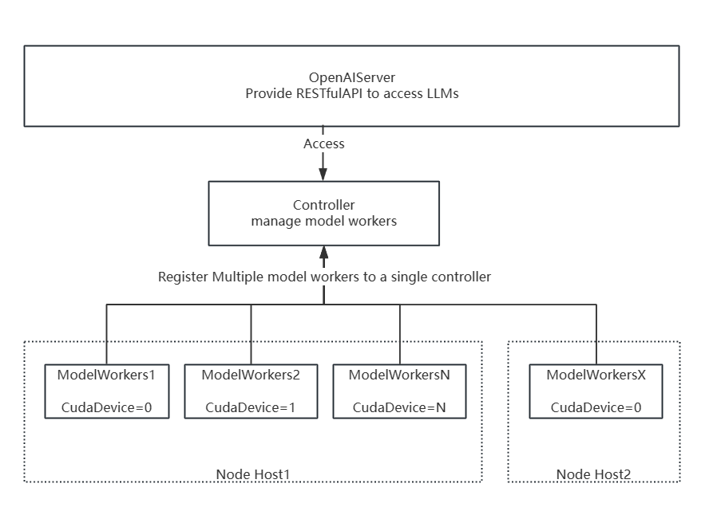

# ChatGLM-MultiGPU-Deploy-FastChat

## 引言

`ChatGLM-Deploy-FastChat` 一文介绍了如何单卡24G部署ChatGLM2-6B，并尝试了在单卡上利用剩余显存部署微调后的模型，但是失败了，因为单卡24G，暂时不够部署两个同体量的模型。

现在，资源就来了，4卡GPU来了，因此整理了多卡多模型部署。一个模型跑在一张卡上。

```
(base) [root@gpu CodeWL]# nvidia-smi 
Thu Aug 17 10:11:12 2023       
+-----------------------------------------------------------------------------+
| NVIDIA-SMI 520.61.05    Driver Version: 520.61.05    CUDA Version: 11.8     |
|-------------------------------+----------------------+----------------------+
| GPU  Name        Persistence-M| Bus-Id        Disp.A | Volatile Uncorr. ECC |
| Fan  Temp  Perf  Pwr:Usage/Cap|         Memory-Usage | GPU-Util  Compute M. |
|                               |                      |               MIG M. |
|===============================+======================+======================|
|   0  Tesla P40           Off  | 00000000:2D:00.0 Off |                    0 |
| N/A   39C    P0    49W / 250W |  18720MiB / 23040MiB |      0%      Default |
|                               |                      |                  N/A |
+-------------------------------+----------------------+----------------------+
|   1  Tesla P40           Off  | 00000000:31:00.0 Off |                    0 |
| N/A   33C    P0    49W / 250W |   4960MiB / 23040MiB |      0%      Default |
|                               |                      |                  N/A |
+-------------------------------+----------------------+----------------------+
|   2  Tesla P40           Off  | 00000000:35:00.0 Off |                    0 |
| N/A   37C    P0    49W / 250W |   4960MiB / 23040MiB |      0%      Default |
|                               |                      |                  N/A |
+-------------------------------+----------------------+----------------------+
|   3  Tesla P40           Off  | 00000000:39:00.0 Off |                    0 |
| N/A   36C    P0    50W / 250W |   1830MiB / 23040MiB |      0%      Default |
|                               |                      |                  N/A |
+-------------------------------+----------------------+----------------------+
                                                                               
+-----------------------------------------------------------------------------+
| Processes:                                                                  |
|  GPU   GI   CI        PID   Type   Process name                  GPU Memory |
|        ID   ID                                                   Usage      |
|=============================================================================|
|    0   N/A  N/A      2364      C   python3                         12184MiB |
+-----------------------------------------------------------------------------+
```

导读材料：

> [https://github.com/lm-sys/FastChat/tree/main#readme](https://github.com/lm-sys/FastChat/tree/main#readme)
>
> [https://github.com/lm-sys/FastChat/blob/main/docs/openai\_api.md](https://github.com/lm-sys/FastChat/blob/main/docs/openai\_api.md)

## 环境准备

`ChatGLM-Deploy-FastChat` 一文中获取FastChat的方式为，`pip install fastchat` 安装依赖包的。这里介绍另一种以源码获取FastChat的方式。

```sh
# 创建chatglm虚拟环境并安装ChatGLM2和FastChat对应的依赖
# 已经安装HuggingFace上模型对应的依赖
# conda actiavte chatglm2-env and install chatglm2 and fastchat requirements.txt
# pip3 install -r requirements.txt -i https://pypi.tuna.tsinghua.edu.cn/simple


# then git clone or download fastchat source code.
git clone https://github.com/lm-sys/FastChat.git
cd FastChat

pip3 install --upgrade pip  # enable PEP 660 support

# 只安装这model_worker,webui两个模块就够了，见FastChat/pyproject.toml
pip3 install -e ".[model_worker,webui]"  -i https://pypi.tuna.tsinghua.edu.cn/simple  
```

## 模型准备

模型下载存放目录

```
--model-path /root/wanglang/models/chatglm2-6b
--model-path /root/wanglang/models/chatglm2-6b-32k
```

## 模型部署

Note: 注意端口对应

### 运行Controller

我们先使用fs运行controller。后去fswokers启动的模型会被注册到controller管理。

```sh
# screen -S 28903.wl-fschat-ctl
python3 -m fastchat.serve.controller --host localhost --port 21003
```

### 运行models wokers(s)

我们使用FastChat多卡部署，且还要支持OpenAI调用。Fast中提到了两种多模型部署方案。

> 方式1：[https://github.com/lm-sys/FastChat/blob/main/docs/openai\_api.md#running-multiple](https://github.com/lm-sys/FastChat/blob/main/docs/openai\_api.md#running-multiple)
>
> 方式2：[https://github.com/lm-sys/FastChat/tree/main#optional-advanced-features](https://github.com/lm-sys/FastChat/tree/main#optional-advanced-features)

我们详细看一下有什么区别。

#### 方式1：

> If you want to run multiple models on the same machine and in the same process, you can replace the `model_worker` step above with a multi model variant:
>
> ```sh
> python3 -m fastchat.serve.multi_model_worker \
>     --model-path lmsys/vicuna-7b-v1.3 \
>     --model-names vicuna-7b-v1.3 \
>     --model-path lmsys/longchat-7b-16k \
>     --model-names longchat-7b-16k
> ```

我们可以查看这种方式是可以运行多个模型的，但是是不是运行到不同的GPT上呢？我们可以查看`fastchat.serve.multi_model_worker.py` 源代码里的参数

<pre class="language-python"><code class="lang-python"><strong># ......
</strong><strong># ......
</strong><strong>if __name__ == "__main__":
</strong>    # Note: Ensure we resolve arg conflicts.  We let `add_model_args` add MOST
    # of the model args but we'll override one to have an append action that
    # supports multiple values.
    parser = argparse.ArgumentParser(conflict_handler="resolve")
    parser.add_argument("--host", type=str, default="localhost")
    parser.add_argument("--port", type=int, default=21002)
    parser.add_argument("--worker-address", type=str, default="http://localhost:21002")
    parser.add_argument(
        "--controller-address", type=str, default="http://localhost:21001"
    )
    add_model_args(parser)
    # Override the model path to be repeated and align it with model names.
    parser.add_argument(
        "--model-path",
        type=str,
        default=[],
        action="append",
        help="One or more paths to model weights to load. This can be a local folder or a Hugging Face repo ID.",
    )
    parser.add_argument(
        "--model-names",
        type=lambda s: s.split(","),
        action="append",
        help="One or more model names.  Values must be aligned with `--model-path` values.",
    )
    parser.add_argument("--limit-worker-concurrency", type=int, default=5)
    parser.add_argument("--stream-interval", type=int, default=2)
    parser.add_argument("--no-register", action="store_true")
    args = parser.parse_args()
    logger.info(f"args: {args}")

    if args.gpus:
        if len(args.gpus.split(",")) &#x3C; args.num_gpus:
            raise ValueError(
                f"Larger --num-gpus ({args.num_gpus}) than --gpus {args.gpus}!"
            )
        os.environ["CUDA_VISIBLE_DEVICES"] = args.gpus
# ......
# ......
</code></pre>

可以看到gpus这个参数，但是并没有明确的指定gpu参数说明。

我们尝试运行，从输出结果可以看到num\_gpus=1，即可用gpu只有一个，默认这个源代码是不支持指定GPU运行模型的。

```sh
python3 -m fastchat.serve.multi_model_worker \
    --model-path  /root/wanglang/models/chatglm2-6b \
    --model-names chatglm2-6b \
    --gpus 1 \
    --model-path  /root/wanglang/models/chatglm2-6b-32k \
    --model-names chatglm2-6b-32k \
    --gpus 2
    
# 得到如下的参数解析
2023-08-17 14:17:15 | INFO | model_worker | args: Namespace(host='localhost', port=21002, worker_address='http://localhost:21002', controller_address='http://localhost:21001', revision='main', device='cuda', gpus='2', num_gpus=1, max_gpu_memory=None, load_8bit=False, cpu_offloading=False, gptq_ckpt=None, gptq_wbits=16, gptq_groupsize=-1, gptq_act_order=False, awq_ckpt=None, awq_wbits=16, awq_groupsize=-1, model_path=['/root/wanglang/models/chatglm2-6b', '/root/wanglang/models/chatglm2-6b-32k'], model_names=[['chatglm2-6b'], ['chatglm2-6b-32k']], limit_worker_concurrency=5, stream_interval=2, no_register=False)
# 发现显存存溢出了，说明这两个模型还是在一张显卡上面跑。

```


#### 方式2

> You can register multiple model workers to a single controller, which can be used for serving a single model with higher throughput or serving multiple models at the same time. When doing so, please allocate different GPUs and ports for different model workers.
>
> ```sh
> # worker 0
> CUDA_VISIBLE_DEVICES=0 python3 -m fastchat.serve.model_worker --model-path lmsys/vicuna-7b-v1.3 --controller http://localhost:21001 --port 31000 --worker http://localhost:31000
> # worker 1
> CUDA_VISIBLE_DEVICES=1 python3 -m fastchat.serve.model_worker --model-path lmsys/fastchat-t5-3b-v1.0 --controller http://localhost:21001 --port 31001 --worker http://localhost:31001
> ```

这里相当于制定了显卡，并运行了两次服务，分别端口不同，我们继续运行下面的脚本测试

<pre class="language-sh"><code class="lang-sh"><strong># 显卡0被占用
</strong># 显卡1
# screen -S wl-fschat-multi-gpu1-wkrs
CUDA_VISIBLE_DEVICES=1 python3 -m fastchat.serve.model_worker \
    --model-path /root/wanglang/models/chatglm2-6b-32k \
    --controller http://localhost:21003 \
    --port 31000 \
    --worker http://localhost:31000

# 显卡2
# screen -S wl-fschat-multi-gpu2-wkrs
<strong>CUDA_VISIBLE_DEVICES=2 python3 -m fastchat.serve.model_worker \
</strong><strong>    --model-path /root/wanglang/models/chatglm2-6b-int4 \
</strong><strong>    --controller http://localhost:21003  \
</strong><strong>    --port 31001 \
</strong><strong>    --worker http://localhost:31001
</strong></code></pre>

运行后我们查看显卡，发现显卡1和显卡2已经被占用了，显卡0是被之前服务占用了。

```
(chatglm) [root@gpu fs-work-logs]# nvidia-smi 
Thu Aug 17 15:28:46 2023       
+-----------------------------------------------------------------------------+
| NVIDIA-SMI 520.61.05    Driver Version: 520.61.05    CUDA Version: 11.8     |
|-------------------------------+----------------------+----------------------+
| GPU  Name        Persistence-M| Bus-Id        Disp.A | Volatile Uncorr. ECC |
| Fan  Temp  Perf  Pwr:Usage/Cap|         Memory-Usage | GPU-Util  Compute M. |
|                               |                      |               MIG M. |
|===============================+======================+======================|
|   0  Tesla P40           Off  | 00000000:2D:00.0 Off |                    0 |
| N/A   39C    P0    49W / 250W |  18724MiB / 23040MiB |      0%      Default |
|                               |                      |                  N/A |
+-------------------------------+----------------------+----------------------+
|   1  Tesla P40           Off  | 00000000:31:00.0 Off |                    0 |
| N/A   33C    P0    49W / 250W |  17360MiB / 23040MiB |      0%      Default |
|                               |                      |                  N/A |
+-------------------------------+----------------------+----------------------+
|   2  Tesla P40           Off  | 00000000:35:00.0 Off |                    0 |
| N/A   36C    P0    49W / 250W |   9298MiB / 23040MiB |      0%      Default |
|                               |                      |                  N/A |
+-------------------------------+----------------------+----------------------+
|   3  Tesla P40           Off  | 00000000:39:00.0 Off |                    0 |
| N/A   36C    P0    50W / 250W |   1830MiB / 23040MiB |      0%      Default |
|                               |                      |                  N/A |
+-------------------------------+----------------------+----------------------+
                                                                               
+-----------------------------------------------------------------------------+
| Processes:                                                                  |
|  GPU   GI   CI        PID   Type   Process name                  GPU Memory |
|        ID   ID                                                   Usage      |
|=============================================================================|
|    0   N/A  N/A      2364      C   python3                         12188MiB |
|    0   N/A  N/A     41549      C   python                           6534MiB |
|    1   N/A  N/A     28053      C   python3                         12400MiB |
|    1   N/A  N/A     41549      C   python                           4958MiB |
|    2   N/A  N/A     33395      C   python3                          4338MiB |
|    2   N/A  N/A     41549      C   python                           4958MiB |
|    3   N/A  N/A     41549      C   python                           1828MiB |
+-----------------------------------------------------------------------------+
```


### 运行gradio

运行gradio查看部署的两个模型。将gradio 参数地址 设置为两个模型的管理controller地址。

```sh
python3 -m fastchat.serve.gradio_web_server_multi \
    --controller-url http://localhost:21003
```

运行以上代码，就可以在Gradio的页面中看到部署的两个模型了


### OpenAI方式部署

以OpenAI方式提供 RESTful API部署，模型管理地址指向controller地址

```sh
python3 -m fastchat.serve.openai_api_server \
    --host localhost \
    --port 8001  \
    --controller-address  http://localhost:21003
# 如果需要提供给局域网，将localhost设置为主机局域网外部可访问IP即可
```


## 总结

上述实现了一台机器上多显卡部署多模型。很容易观察到修改host为局域网地址，可以实现多节点多卡多模型部署。即如下的流程图。

<figure><figcaption><p>FastChat-Deploy-Multi-Models</p></figcaption></figure>

